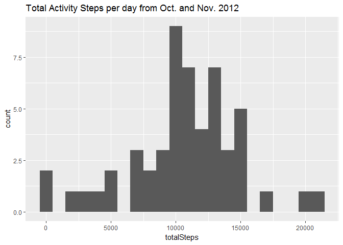
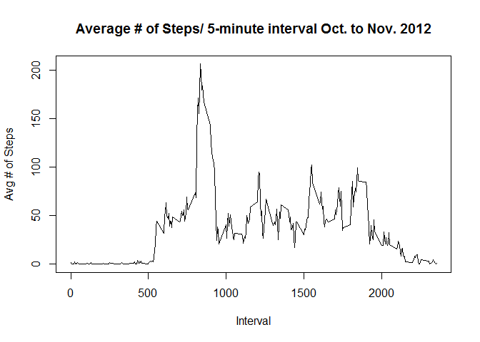
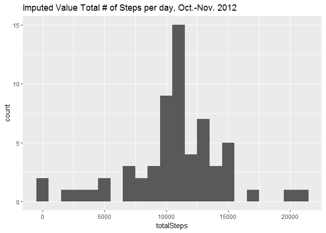

# Reproducible Research: Peer Assessment 1


## Loading and preprocessing the data


1. reading in the dataset and/or processing the data


```r
#rm(list= ls())

#setwd("C:/WorkingR/Course5Week2")

fileUrl <- "https://d396qusza40orc.cloudfront.net/repdata%2Fdata%2Factivity.zip"
# 
# https://d396qusza40orc.cloudfront.net/repdata%2Fdata%2Factivity.zip
#if(!file.exists("data")) {dir.create("data")}
# 
download.file(fileUrl, destfile = file.path(getwd(), "repdata%2Fdata%2Factivity.zip"))
# 
unzip(zipfile=file.path(getwd(), "repdata%2Fdata%2Factivity.zip"),exdir=getwd())
activity <- read.csv("activity.csv", stringsAsFactors=FALSE)

activity$date <- as.Date(activity$date, "%Y-%m-%d")

names(activity)
```

```
## [1] "steps"    "date"     "interval"
```

```r
summary(activity)
```

```
##      steps             date               interval     
##  Min.   :  0.00   Min.   :2012-10-01   Min.   :   0.0  
##  1st Qu.:  0.00   1st Qu.:2012-10-16   1st Qu.: 588.8  
##  Median :  0.00   Median :2012-10-31   Median :1177.5  
##  Mean   : 37.38   Mean   :2012-10-31   Mean   :1177.5  
##  3rd Qu.: 12.00   3rd Qu.:2012-11-15   3rd Qu.:1766.2  
##  Max.   :806.00   Max.   :2012-11-30   Max.   :2355.0  
##  NA's   :2304
```

2. Histogram of the total number of steps taken each day


```r
# Filter out the NA's
ccActivity <- activity[(complete.cases(activity)),]   

# sum up all the steps per day
totalStepByDate <- aggregate(ccActivity$steps, list(date=ccActivity$date), sum)
names(totalStepByDate)[2] <- "totalSteps"   # rename column "x" to "totalSteps"

ccActivityDtRep <- as.data.frame(rep(totalStepByDate$date,totalStepByDate$totalSteps))

class(ccActivityDtRep)
```

```
## [1] "data.frame"
```

```r
#ccActivityDtRepDF <- as.data.frame(ccActivityDtRep)

# class(ccActivityDtRepDF)
# 
# class(ccActivityDtRepDF[,1])
names(ccActivityDtRep)
```

```
## [1] "rep(totalStepByDate$date, totalStepByDate$totalSteps)"
```

```r
names(ccActivityDtRep) <- "date"

library(ggplot2)
```

```
## Warning: package 'ggplot2' was built under R version 3.3.2
```

```r
# 'date' must be date type for ggplot to label x-axis correctly
ggplot(ccActivityDtRep, aes(x=date)) + geom_histogram(stat = "count")
```

```
## Warning: Ignoring unknown parameters: binwidth, bins, pad
```

<!-- -->

## What is mean total number of steps taken per day?

```r
MeanStepByDate <- aggregate(ccActivity$steps, list(date=ccActivity$date), mean)
names(MeanStepByDate) [2] <- c("AvgSteps")
MeanStepByDate
```

```
##          date   AvgSteps
## 1  2012-10-02  0.4375000
## 2  2012-10-03 39.4166667
## 3  2012-10-04 42.0694444
## 4  2012-10-05 46.1597222
## 5  2012-10-06 53.5416667
## 6  2012-10-07 38.2465278
## 7  2012-10-09 44.4826389
## 8  2012-10-10 34.3750000
## 9  2012-10-11 35.7777778
## 10 2012-10-12 60.3541667
## 11 2012-10-13 43.1458333
## 12 2012-10-14 52.4236111
## 13 2012-10-15 35.2048611
## 14 2012-10-16 52.3750000
## 15 2012-10-17 46.7083333
## 16 2012-10-18 34.9166667
## 17 2012-10-19 41.0729167
## 18 2012-10-20 36.0937500
## 19 2012-10-21 30.6284722
## 20 2012-10-22 46.7361111
## 21 2012-10-23 30.9652778
## 22 2012-10-24 29.0104167
## 23 2012-10-25  8.6527778
## 24 2012-10-26 23.5347222
## 25 2012-10-27 35.1354167
## 26 2012-10-28 39.7847222
## 27 2012-10-29 17.4236111
## 28 2012-10-30 34.0937500
## 29 2012-10-31 53.5208333
## 30 2012-11-02 36.8055556
## 31 2012-11-03 36.7048611
## 32 2012-11-05 36.2465278
## 33 2012-11-06 28.9375000
## 34 2012-11-07 44.7326389
## 35 2012-11-08 11.1770833
## 36 2012-11-11 43.7777778
## 37 2012-11-12 37.3784722
## 38 2012-11-13 25.4722222
## 39 2012-11-15  0.1423611
## 40 2012-11-16 18.8923611
## 41 2012-11-17 49.7881944
## 42 2012-11-18 52.4652778
## 43 2012-11-19 30.6979167
## 44 2012-11-20 15.5277778
## 45 2012-11-21 44.3993056
## 46 2012-11-22 70.9270833
## 47 2012-11-23 73.5902778
## 48 2012-11-24 50.2708333
## 49 2012-11-25 41.0902778
## 50 2012-11-26 38.7569444
## 51 2012-11-27 47.3819444
## 52 2012-11-28 35.3576389
## 53 2012-11-29 24.4687500
```

## What is the average daily activity pattern?
1. Make a time series plot (i.e. ) of the 5-minute interval (x-axis) and the average number of steps taken, averaged
across all days (y-axis)

```r
ccActivityInterval <- activity[(complete.cases(activity)), c(1,3)]  # exclude 2nd column 'date' 
avgDaily5MinInterval <- aggregate(ccActivityInterval$steps, list(interval=ccActivityInterval$interval), mean)
names(avgDaily5MinInterval)[2] <- "intervalAvgSteps"   # rename column "x" to 

plot(avgDaily5MinInterval$intervalAvgSteps ~ avgDaily5MinInterval$interval, type="l", main ="Average # of Steps/ 5-minute interval 10/02/12 to 11/29/12", xlab = "Interval", ylab = "Avg # of Steps")
```

<!-- -->

2. Which 5-minute interval, on average across all the days in the dataset, contains the maximum number of steps?


```r
avgDaily5MinInterval[(avgDaily5MinInterval$intervalAvgSteps > as.integer(max(avgDaily5MinInterval$intervalAvgSteps))),]
```

```
##     interval intervalAvgSteps
## 104      835         206.1698
```


## Imputing missing values
1. Calculate and report the total number of missing values in the dataset (i.e. the total number of rows with NAs)


```r
NAcases <- is.na(activity$steps)
sum(NAcases)
```

```
## [1] 2304
```

2. Devise a strategy for filling in all of the missing values in the dataset. The strategy does not need to be sophisticated. For example, you could use the mean/median for that day, or the mean for that 5-minute interval, etc.


```r
MeanStepByInterval <- aggregate(ccActivity$steps, list(interval=ccActivity$interval), mean)
activityImputed <- merge(activity, MeanStepByInterval, all.x = TRUE )   ## like left join
```

3. Create a new dataset that is equal to the original dataset but with the missing data filled in.


```r
activityImputed <- dplyr::mutate(activityImputed, imputedSteps = ifelse(is.na(steps), x, steps))
```

4. Make a histogram of the total number of steps taken each day and Calculate and report the mean and median total number of steps taken per day. 


```r
totalStepByDate <- aggregate(activityImputed$imputedSteps, list(date=activityImputed$date), sum)
names(totalStepByDate)[2] <- "totalSteps"   # rename column "x" to 

activityImputedDtRep <- as.data.frame(rep(totalStepByDate$date,totalStepByDate$totalSteps))
names(activityImputedDtRep) <- c("date")

ggplot(activityImputedDtRep, aes(x=date)) + geom_histogram(stat = "count") +
      labs(title="Imputed Value Total # of Steps, Oct.-Nov. 2012")
```

```
## Warning: Ignoring unknown parameters: binwidth, bins, pad
```

<!-- -->

Do these values differ from the estimates from the first part of the assignment? What is the impact of # imputing missing data on the estimates of the total daily number of steps?


```r
MeanImputedStepByDate <- aggregate(activityImputed$imputedSteps, list(date=activityImputed$date), mean)
names(MeanImputedStepByDate)[2] <- "AvgSteps"   # rename column "x" to 

MedianImputedStepByDate <- aggregate(activityImputed$imputedSteps, list(date=activityImputed$date), median)

MeanImputedStepByDate$source <- c("Imputed Value")
#MeanImputedStepByDate

MeanStepByDate$source <- c("NAs removed")

#MeanStepByDate

MeanStepsCompare <- rbind(MeanStepByDate, MeanImputedStepByDate )

#MeanStepsCompare

ggplot(MeanStepsCompare, aes(x=date, y=AvgSteps)) +
      geom_line() +
      facet_wrap(~source, nrow=2) +
      ggtitle("Compare Avg Steps by Date")
```

<!-- -->


## Are there differences in activity patterns between weekdays and weekends?

For this part the weekdays() function may be of some help here. Use the dataset with the filled-in missing values for this part.

1. Create a new factor variable in the dataset with two levels -"weekday" and "weekend" indicating whether a given date is a weekday or weekend day.


```r
activityImputed$weekCategory <- factor(ifelse(weekdays(activityImputed$date) %in% c("Saturday", "Sunday"), c("weekend"),c("weekday")))
```

2. Make a panel plot containing a time series plot (i.e. type="1") of the 5-minute interval (x-axis) and the average number of steps taken, averaged across all weekday days or weekend days (y-axis). See the README file in the GitHub repository to see an example of what this plot should look like using simulated data.


```r
MeanStepByIntervalByWeekCat <- aggregate(activityImputed$imputedSteps, by=list(WeekCat = activityImputed$weekCategory, interval = activityImputed$interval), mean)

names(MeanStepByIntervalByWeekCat)[3] <- c("intervalAvgSteps")

ggplot(MeanStepByIntervalByWeekCat, aes(x=interval, y=intervalAvgSteps)) +
      geom_line() +
      facet_wrap(~WeekCat, nrow=2)
```

<!-- -->


